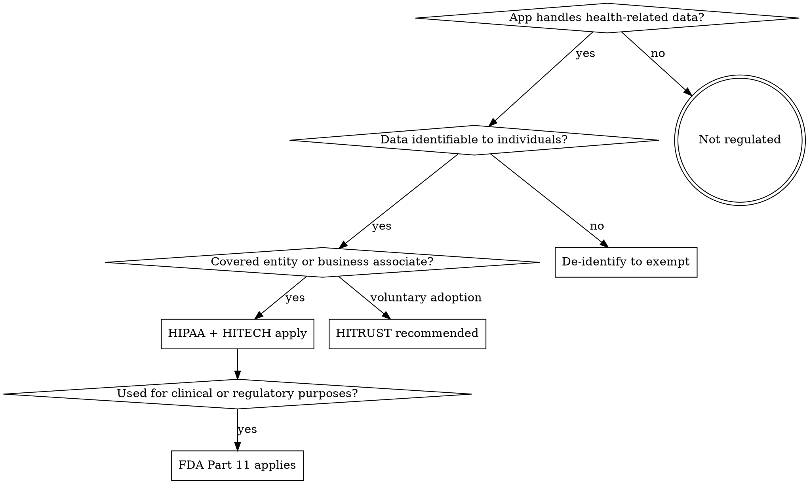

# Healthcare Regulatory Compliance

Four frameworks govern healthcare software: **HIPAA** (data privacy/security), **HITECH** (strengthens HIPAA enforcement, extends to business associates), **HITRUST CSF** (unified controls framework certifiable against HIPAA), and **FDA 21 CFR Part 11** (electronic records/signatures for regulated activities). This skill covers application-level compliance patterns -- what to build into your code. For infrastructure-level controls (encryption at rest, IAM, network segmentation, IaC policies), see `implementing-compliance`.

## When to Use

**Apply this skill when:**
- App stores, processes, or transmits health-related data from users
- App integrates with healthcare providers, EHR systems, or health APIs
- Health data is sent to AI/ML services for processing
- App runs on mobile devices where health data may be cached
- App will be used in clinical, research, or FDA-regulated contexts

**Do NOT apply when:**
- App handles only de-identified/anonymized data (verify with Safe Harbor -- see below)
- Health data never touches your system (pure pass-through with no storage/processing)
- App is purely consumer wellness with no clinical claims and no identifiable health data

## Regulation Applicability



**Key terms:**
- **Covered Entity:** Health plan, healthcare clearinghouse, or healthcare provider that transmits health information electronically
- **Business Associate:** Entity that creates, receives, maintains, or transmits PHI on behalf of a covered entity
- **PHI:** Health data + any of the 18 HIPAA identifiers (see below)

## PHI Identification -- The 18 HIPAA Identifiers

Health data becomes Protected Health Information (PHI) when combined with ANY of these:

| # | Identifier | Example |
|---|------------|---------|
| 1 | Names | Full name, maiden name |
| 2 | Geographic data smaller than state | Street address, city, ZIP code |
| 3 | Dates (except year) | Birth date, admission date, discharge date |
| 4 | Phone numbers | Any format |
| 5 | Fax numbers | Any format |
| 6 | Email addresses | Any email |
| 7 | Social Security numbers | SSN |
| 8 | Medical record numbers | MRN, chart number |
| 9 | Health plan beneficiary numbers | Insurance ID |
| 10 | Account numbers | Patient account number |
| 11 | Certificate/license numbers | DEA, NPI, driver's license |
| 12 | Vehicle identifiers | VIN, license plate |
| 13 | Device identifiers/serial numbers | UDI, device serial |
| 14 | Web URLs | Personal URLs |
| 15 | IP addresses | Any IP |
| 16 | Biometric identifiers | Fingerprint, voiceprint, retinal scan |
| 17 | Full-face photographs | Any identifying photo |
| 18 | Any other unique identifying number | Internal user IDs, etc. |

**In practice:** If your app stores health-related notes linked to a `userId`, that userId is identifier #18. All note content is PHI.

## Core Application-Level Patterns

### 1. Authorization on Every Data Access

Every query and mutation touching PHI must verify the requesting user owns or is authorized to access the record. Obscurity of record IDs is NOT access control.

```typescript
// WRONG - any authenticated user can access any record
export const getNote = query({
  args: { id: v.id("notes") },
  handler: async (ctx, { id }) => {
    return await ctx.db.get(id);
  },
});

// RIGHT - verify ownership
export const getNote = query({
  args: { id: v.id("notes") },
  handler: async (ctx, { id }) => {
    const userId = await getUserId(ctx);
    if (!userId) return null;
    const note = await ctx.db.get(id);
    if (!note || note.userId !== userId) return null;
    return note;
  },
});
```

Apply the same pattern to ALL mutations (update, delete) -- not just queries.

### 2. Immutable Audit Trail

Log every create, read, update, delete of PHI. Audit logs must be:
- **Immutable:** No delete or update mutations for audit records
- **Retained:** Minimum 6 years (HIPAA), or record lifetime (FDA Part 11)
- **Indexed:** Searchable by user, resource, timestamp, action

```typescript
// Schema
auditLog: defineTable({
  timestamp: v.number(),
  userId: v.string(),
  action: v.union(
    v.literal("create"), v.literal("read"),
    v.literal("update"), v.literal("delete"),
    v.literal("export"), v.literal("ai_disclosure")
  ),
  resourceType: v.string(),
  resourceId: v.string(),
  metadata: v.optional(v.string()),
}).index("by_user", ["userId"])
  .index("by_resource", ["resourceType", "resourceId"])
  .index("by_timestamp", ["timestamp"]),
```

**Never include PHI content in audit logs.** Log resource IDs, action types, and non-sensitive metadata only.

### 3. No PHI in Application Logs

Every `console.log`, `console.error`, or structured log statement must be audited for PHI leakage.

```typescript
// WRONG - logs PHI
console.log({ messageContent });  // AI response derived from PHI
console.log({ item });            // Note object containing PHI

// RIGHT - log only operational metadata
console.log({ noteId, action: "summary_generated", model: "gpt-4" });
```

### 4. Soft Delete with Version History

Never permanently delete PHI records. Use soft-delete with audit trail. For FDA Part 11, preserve all prior versions with change attribution.

```typescript
// Schema additions
notes: defineTable({
  // ... existing fields
  deletedAt: v.optional(v.number()),
  deletedBy: v.optional(v.string()),
  version: v.number(),
}),

noteVersions: defineTable({
  noteId: v.id("notes"),
  version: v.number(),
  title: v.string(),
  content: v.string(),
  changedBy: v.string(),
  changedAt: v.number(),
}),
```

### 5. Session Security

| Control | Requirement | Standard |
|---------|-------------|----------|
| Idle timeout | 15 minutes | HIPAA Security Rule |
| Absolute session max | 8 hours | Best practice |
| MFA | Required for all PHI access | HIPAA, HITRUST |
| Failed login lockout | 5 attempts, 30-min lockout | HIPAA, HITRUST |

Configure these in your auth provider (e.g., Clerk session settings).

## AI/ML Healthcare Compliance

### De-Identification Before AI Processing

If your AI provider does not have a signed BAA, you MUST de-identify data before sending. Two HIPAA-approved methods:

**Safe Harbor** (45 CFR 164.514(b)): Remove all 18 identifiers. Simpler, more conservative.

**Expert Determination** (45 CFR 164.514(a)): Statistician certifies re-identification risk is very small. More flexible, requires expertise.

See `references/phi-deidentification.md` for implementation patterns.

### BAA Requirements for AI Services

| AI Provider | BAA Available | HIPAA-Eligible Offering |
|-------------|---------------|-------------------------|
| OpenAI API (standard) | No | Not eligible for PHI |
| Azure OpenAI Service | Yes | Enterprise with BAA |
| AWS Bedrock | Yes | With BAA addendum |
| Google Vertex AI | Yes | With BAA |
| Anthropic API | Contact sales | Enterprise agreements |

**No BAA = no PHI.** Either de-identify first or switch to a BAA-covered provider.

### Accounting of AI Disclosures

HITECH Section 13405(c) requires tracking every disclosure of PHI to third parties. Every AI API call containing PHI is a disclosure.

```typescript
// Log every AI disclosure in audit trail
await logAudit({
  action: "ai_disclosure",
  resourceType: "note",
  resourceId: noteId,
  metadata: JSON.stringify({
    provider: "azure-openai",
    model: "gpt-4",
    deidentified: false,
    baaInPlace: true,
  }),
});
```

### AI as Medical Device (SaMD)

FDA may classify AI that provides clinical decision support as Software as a Medical Device.

**SaMD likely applies if AI:**
- Diagnoses or screens for medical conditions
- Recommends treatments or dosages
- Predicts clinical outcomes
- Monitors physiological conditions in real-time

**SaMD likely does NOT apply if AI:**
- Summarizes notes without clinical interpretation
- Provides general wellness information (not clinical)
- Performs administrative tasks (scheduling, billing, indexing)

See `references/fda-21-cfr-part-11.md` for full SaMD criteria and Part 11 applicability.

## Mobile PHI Protection

### Data at Rest on Device

- Use platform secure storage: iOS Keychain Services, Android EncryptedSharedPreferences
- **Never** store PHI in AsyncStorage, localStorage, SQLite without encryption, or plain files
- Clear cached PHI when app enters background

```typescript
import { AppState } from 'react-native';

AppState.addEventListener('change', (state) => {
  if (state === 'background' || state === 'inactive') {
    clearCachedPHI();
  }
});
```

### Device Security Controls

| Control | Implementation | Requirement |
|---------|---------------|-------------|
| Device passcode/biometric | Require before app access | HIPAA, HITRUST |
| Jailbreak/root detection | Warn or restrict access | HITRUST |
| Screenshot prevention | `FLAG_SECURE` (Android), screen capture listener (iOS) | Best practice |
| Remote wipe | MDM integration or in-app data purge | HIPAA |
| Clipboard protection | Clear clipboard after paste timeout | HITRUST |

## Third-Party Service Evaluation

Before any service processes PHI, evaluate:

| Criterion | Requirement | Why |
|-----------|-------------|-----|
| BAA signed | Required | Legal obligation under HIPAA |
| SOC 2 Type II report | Within 12 months | Security assurance |
| Encryption at rest | AES-256 or equivalent | HIPAA Security Rule |
| Encryption in transit | TLS 1.2+ | HIPAA Security Rule |
| Data residency | Matches your requirements | State/federal reqs |
| Breach notification SLA | Supports your timeline | HIPAA: 60 days, HITECH: enhanced |
| Sub-processor list | Reviewed and approved | HIPAA BA chain |
| HITRUST certified | Preferred | Strongest compliance proof |

**HITECH extension:** Business associates are directly liable for HIPAA compliance, not just contractually obligated. This means each vendor must independently demonstrate compliance.

## State Health Privacy Laws

Several states impose requirements stricter than HIPAA. These may apply even when your entity is NOT a HIPAA Covered Entity.

| State | Law | Key Difference from HIPAA |
|-------|-----|--------------------------|
| California | CMIA + CCPA/CPRA | Broader "medical information" definition; private right of action |
| Texas | HB 300 | Stricter penalties; broader covered entity definition; training required |
| New York | SHIELD Act | 72-hour breach notification (vs HIPAA's 60 days) |
| Washington | My Health My Data Act | Applies to "consumer health data" outside HIPAA; consent required before collection |
| Connecticut | Public Act 23-56 | Consumer health data protections similar to Washington |

**Key risk:** Washington and California laws apply to consumer health data even when there is no Covered Entity relationship. A consumer-facing health note-taking app available in those states must comply regardless of HIPAA status.

## Common Mistakes

| Mistake | Why It's Wrong | Fix |
|---------|---------------|-----|
| "Our cloud provider handles compliance" | You're responsible for application-level controls | Implement authorization, audit, encryption in YOUR code |
| "We don't store PHI, just notes" | Notes linked to userId = PHI if health-related | Classify data using 18-identifier test |
| "TLS covers our encryption needs" | TLS = transit only. Need at-rest too | Verify database encryption, use platform secure storage |
| "We'll add audit logging later" | Retroactive compliance is nearly impossible | Build audit logging from day one |
| "AI summaries aren't PHI" | Data derived from PHI is still PHI | Same protections on AI outputs |
| "De-identification is too complex" | Safe Harbor method is straightforward | Strip 18 identifiers, document process |
| "HITRUST is optional so we'll skip it" | True, but it's the strongest HIPAA compliance proof | Prioritize for enterprise healthcare customers |
| "State laws don't apply to us" | Many states have stricter health privacy laws | Check CA (CCPA/CMIA), TX, NY, WA health privacy laws |

## Regulatory Deep Dives

For detailed framework requirements:
- `references/hipaa-hitech.md` -- HIPAA Privacy/Security/Breach Rules + HITECH enhancements
- `references/hitrust-csf.md` -- HITRUST 14 control categories (00-13), assessment levels (e1, i1, r2)
- `references/fda-21-cfr-part-11.md` -- Electronic records/signatures, SaMD classification
- `references/phi-deidentification.md` -- Safe Harbor and Expert Determination methods

## Related Skills

- `implementing-compliance` -- Infrastructure controls, encryption, IAM, network, policy-as-code
- `compliance-architecture` -- Enterprise compliance architecture, security checklists
- `hipaa-compliance` -- HIPAA-specific audit logging code patterns
- `managing-secrets` -- Secrets handling for credentials adjacent to PHI systems
