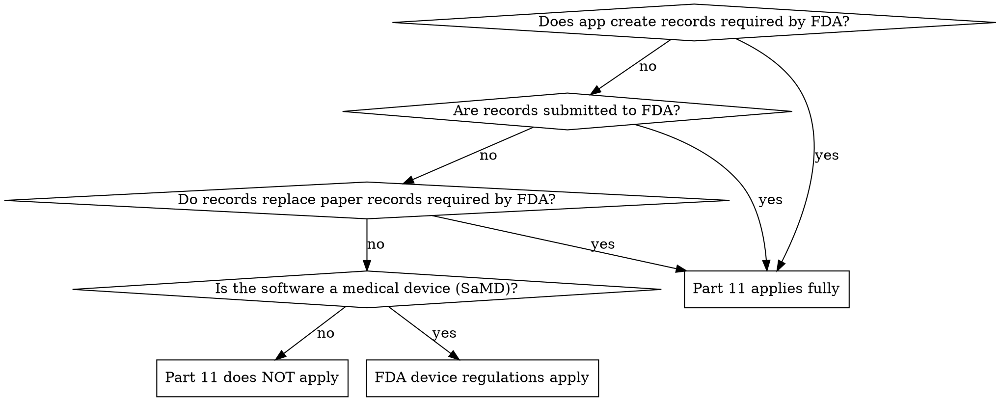

# FDA 21 CFR Part 11 Reference

## Overview

21 CFR Part 11 establishes FDA requirements for electronic records and electronic signatures. It applies when electronic records are used to meet FDA predicate rules (regulations that require records to be maintained or submitted to FDA).

## When Part 11 Applies



**Common scenarios where Part 11 applies:**
- Clinical trial data collection (eCRF systems)
- Laboratory information management systems (LIMS)
- Electronic batch records in pharmaceutical manufacturing
- Adverse event reporting systems
- Quality management systems for FDA-regulated products
- Electronic signatures on FDA-required documents

**Common scenarios where Part 11 does NOT apply:**
- General note-taking apps (even if used by healthcare workers)
- Consumer wellness apps without clinical claims
- Administrative healthcare systems (scheduling, billing)
- Apps that don't create, maintain, or submit FDA-required records

**Important:** Even if Part 11 doesn't apply, HIPAA and HITECH still govern health data. Part 11 is an additional layer for FDA-regulated activities.

## Subpart B -- Electronic Records (11.10)

### System Validation (11.10(a))

Systems must be validated to ensure accuracy, reliability, consistent intended performance, and the ability to discern invalid or altered records.

**Requirements:**
- Installation Qualification (IQ): Verify system is installed correctly
- Operational Qualification (OQ): Verify system operates as specified
- Performance Qualification (PQ): Verify system performs reliably under real conditions
- Validation documentation maintained and updated

**For software:**
- Comprehensive test suite covering all record operations
- Documented test plans with acceptance criteria
- Test execution evidence (test results, screenshots)
- Regression testing after changes
- Periodic revalidation (annual or after significant changes)

### Readable and Accurate Copies (11.10(b))

Systems must generate accurate and complete copies of records in both human-readable and electronic form suitable for inspection.

**Implementation:**
- Export to standard formats (PDF, CSV, JSON)
- Include all metadata (timestamps, signatures, version history)
- Exports must be complete (no data loss in conversion)
- Print functionality with full record content

### Record Protection (11.10(c))

Records must be protected throughout their retention period to enable accurate retrieval. Records must be recoverable.

**Implementation:**
- Never permanently delete records (soft-delete only)
- Regular backup verification
- Disaster recovery procedures tested
- Data migration procedures for platform changes
- Encryption at rest for all record stores

### System Access (11.10(d))

Limit system access to authorized individuals.

**Implementation:**
- Unique user identification
- Role-based access control with least privilege
- Account lockout after failed attempts
- Access review procedures (quarterly minimum)
- Prompt deactivation of terminated users

### Audit Trails (11.10(e))

**This is the most critical Part 11 requirement for software.**

Must maintain computer-generated, time-stamped audit trails that:
1. Record the date/time of operator entries and actions
2. Independently record all record creation, modification, and deletion
3. Record the identity of the operator
4. Do not obscure previously recorded information
5. Preserve both the old value and new value for modifications
6. Are retained for the lifetime of the record (not just 6 years like HIPAA)
7. Are available for FDA inspection and review
8. Cannot be modified by ordinary means

**Implementation pattern:**

```typescript
// Version tracking for every record change
noteVersions: defineTable({
  noteId: v.id("notes"),
  version: v.number(),
  // Preserve BOTH old and new values
  title: v.string(),
  content: v.string(),
  summary: v.optional(v.string()),
  // Attribution
  changedBy: v.string(),
  changedAt: v.number(),     // Computer-generated timestamp
  changeType: v.union(
    v.literal("create"),
    v.literal("modify"),
    v.literal("delete")      // Soft-delete, not actual deletion
  ),
  changeReason: v.optional(v.string()), // Why the change was made
}),
```

**Key:** Every modification creates a new version. Old versions are never overwritten or deleted. The audit trail must be a complete, chronological record of every change.

### Authority Checks (11.10(g))

Use authority checks to ensure only authorized individuals can:
- Use the system
- Electronically sign records
- Access specific operations or devices
- Alter records

**Implementation:**
- Permission model (not just authentication)
- Different permissions for create, read, update, sign
- Authority checks enforced at the server, not just UI
- Log all authority check failures

### Device Checks (11.10(h))

Use device checks (e.g., terminal checks) to determine validity of data input source.

**Implementation:**
- Device registration/identification
- Mobile: device integrity checks (jailbreak/root detection)
- Known device tracking (alert on new device access)
- IP-based anomaly detection

### Training (11.10(i))

Personnel using the system must be trained and have documented training records.

**Organizational requirement** -- not a code feature, but the system should support:
- Training acknowledgment tracking
- Version-specific training (retrain on system updates)

### Documentation Controls (11.10(k))

Written policies controlling system documentation, including:
- Distribution, access, and use of documentation
- Revision and change control procedures
- Document retention procedures

### Open vs Closed Systems (11.10 vs 11.30)

**Closed system:** Environment where access is controlled by the people responsible for the content (e.g., internal enterprise app with managed users).

**Open system:** Environment where access is NOT controlled by the content owners (e.g., internet-accessible app). Requires additional controls:
- Document encryption
- Digital signatures (not just electronic signatures)
- Additional access controls beyond the system itself

**Most web/mobile apps are open systems** and require the stricter 11.30 controls.

## Subpart C -- Electronic Signatures

### Signature Manifestation (11.50)

Signed electronic records must display:
1. Printed name of the signer
2. Date and time the signature was executed
3. Meaning associated with the signature (e.g., "approved", "reviewed", "authored")

### General Signature Requirements (11.100)

- Each electronic signature must be unique to one individual
- Not reused or reassigned to anyone else
- Identity verified before establishing electronic signature
- At least two distinct identification components (e.g., user ID + password)

### Biometric vs Non-Biometric Signatures (11.200)

**Non-biometric (password-based):**
- Must use at least two components (ID + password)
- For first signing in a continuous session: both components required
- For subsequent signings in same session: at least one component (e.g., password re-entry)
- Temporary lockout after multiple failed attempts

**Biometric (fingerprint, face, etc.):**
- Must be designed to ensure they cannot be used by anyone other than the genuine owner
- No specific two-component requirement

**OAuth/SSO consideration:** Single sign-on with Google/Apple may not satisfy the two-component requirement if it's a single authentication event. Consider requiring password re-entry or biometric confirmation for signing actions.

## Software as a Medical Device (SaMD)

### What is SaMD?

Software intended to be used for medical purposes without being part of a hardware medical device. The FDA regulates SaMD under the Federal Food, Drug, and Cosmetic Act.

### SaMD Classification Framework

The FDA uses the International Medical Device Regulators Forum (IMDRF) framework:

| Significance of Decision | State of Healthcare Situation |
|--------------------------|------|
| | Critical | Serious | Non-serious |
| Treat or diagnose | Class III (highest risk) | Class II | Class II |
| Drive clinical management | Class II | Class II | Class I |
| Inform clinical management | Class I | Class I | Class I |

### AI/ML as SaMD

FDA has specific guidance for AI/ML-based SaMD:

**Likely regulated as SaMD:**
- AI that diagnoses diseases from clinical notes
- AI that predicts patient deterioration
- AI that recommends treatment changes
- AI that triages patients based on clinical data
- AI that identifies adverse drug reactions

**Likely NOT regulated as SaMD:**
- AI that summarizes notes for administrative efficiency
- AI that transcribes clinical dictation
- AI that performs spell-check or grammar correction
- AI that generates appointment reminders
- AI that calculates billing codes (administrative, not clinical)

**Gray area -- context matters:**
- AI that highlights concerning patterns in notes (depends on clinical intent)
- AI that categorizes notes by condition (depends on how output is used)
- AI wellness insights without clinical claims

### SaMD Regulatory Pathway

If your software is SaMD, you need:
1. **Classification determination** (FDA pre-submission or self-classification)
2. **Quality Management System** (QMS per 21 CFR 820)
3. **510(k) or De Novo** submission (depending on classification)
4. **Postmarket surveillance** requirements
5. **Change management** per FDA guidance (Predetermined Change Control Plan for AI/ML)

### Part 11 + SaMD

If your software is both SaMD AND uses electronic records/signatures:
- Part 11 requirements apply to all records related to the device
- Design history file, device master record, device history record must comply
- Complaint files and adverse event reports must comply
- Quality system records must comply

## Part 11 Compliance Checklist for Software

### Electronic Records
- [ ] System validated (IQ/OQ/PQ documentation)
- [ ] Export to human-readable format (PDF, print)
- [ ] Soft-delete only (no permanent record deletion)
- [ ] Backup and recovery tested
- [ ] Unique user identification
- [ ] Role-based access control
- [ ] Account lockout on failed attempts
- [ ] Computer-generated audit trail for ALL record changes
- [ ] Audit trail preserves old AND new values
- [ ] Audit trail retained for record lifetime
- [ ] Audit trail not modifiable by ordinary means
- [ ] Authority checks on all operations
- [ ] Device identification/validation
- [ ] Training records maintained
- [ ] System documentation controlled

### Electronic Signatures (if applicable)
- [ ] Signature displays: name, date/time, meaning
- [ ] Unique to one individual, not reusable
- [ ] Two identification components (ID + password minimum)
- [ ] Re-authentication for signing actions
- [ ] Signature bound to specific record version
- [ ] Signed records cannot be modified without new signature
